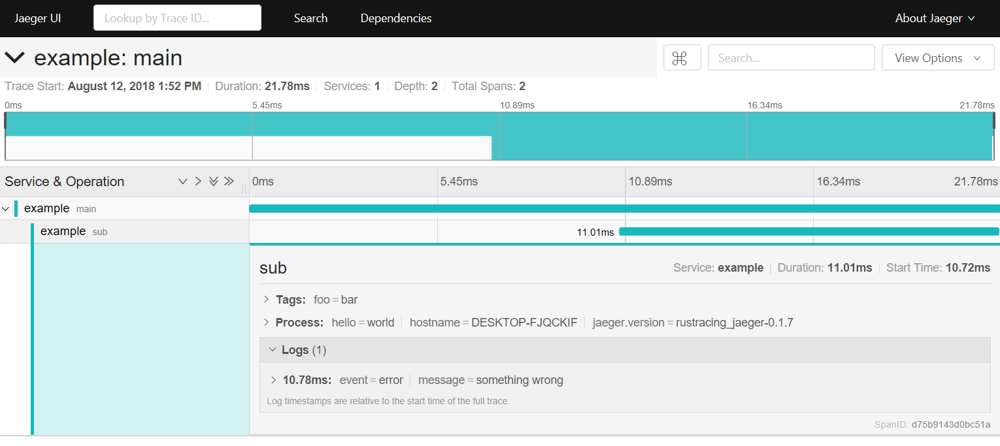

cf-rustracing-jaeger
=================

[](https://crates.io/crates/cf-rustracing-jaeger)
[](https://docs.rs/cf-rustracing-jaeger)
[](LICENSE)

[Jaeger][jaeger] client library created on top of [cf-rustracing].

[jaeger]: https://github.com/jaegertracing/jaeger
[cf-rustracing]: https://crates.io/crates/cf-rustracing

[Documentation](https://docs.rs/cf-rustracing-jaeger)

Examples
--------

### Basic Usage

```rust
use cf_rustracing::sampler::AllSampler;
use cf_rustracing_jaeger::Tracer;
use cf_rustracing_jaeger::reporter::JaegerCompactReporter;
use std::net::Ipv4Addr;

#[tokio::main]
async fn main() {
    // Creates a tracer
    let (tracer, mut span_rx) = Tracer::new(AllSampler);
    {
        let span = tracer.span("sample_op").start();
        // Do something
    
    } // The dropped span will be sent to `span_rx`
    
    let span = span_rx.recv().await.unwrap();
    assert_eq!(span.operation_name(), "sample_op");
    
    // Reports this span to the local jaeger agent
    let reporter = JaegerCompactReporter::new(
        "sample_service",
        (Ipv4Addr::LOCALHOST, 6831).into(),
        (Ipv4Addr::LOCALHOST, 0).into(),
    )
    .await
    .unwrap();
    
    reporter.report(&[span]).await.unwrap();
}
```

### Executes `report.rs` example

```console
# Run jaeger in background
$ docker run -d -p6831:6831/udp -p6832:6832/udp -p16686:16686 jaegertracing/all-in-one:latest

# Report example spans
$ cargo run --example report

# View spans (see the image below)
$ firefox http://localhost:16686/
```



References
----------

- [Jaeger Client Library](https://www.jaegertracing.io/docs/latest/client-libraries/)
